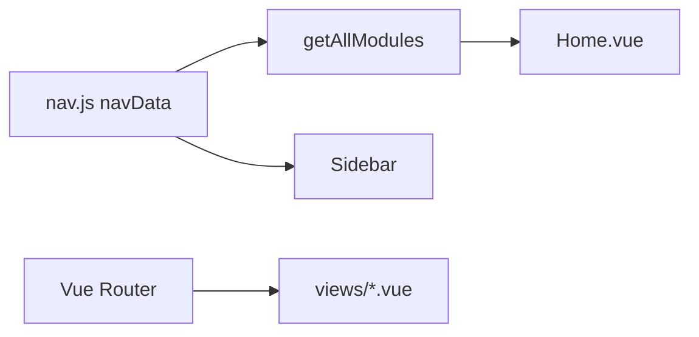

# node-learn 项目分析

本文档从架构、目录与数据流角度描述仓库 **node-learn**：以 Vue 3 提供可视化学习界面，以独立 Node 脚本演示各内置模块与网络相关能力。侧重「项目是什么、如何组织」，与 [README.md](README.md) 中的「如何运行」互为补充。

---

## 1. 项目目标与受众

- **目标**：系统学习 Node.js 内置 API（Path、OS、Process、子进程、Events、Util、FS、Crypto、Zlib 等）及 HTTP / Express 等网络侧能力，部分主题延伸至 Express 与 MySQL 的集成示例。
- **受众**：正在跟随文档与示例学习 Node 的开发者；需要快速定位「某主题对应哪个页面、哪段示例脚本」时，可对照本文与导航。

---

## 2. 技术栈与运行时

| 层级 | 技术 |
|------|------|
| 前端 | Vue 3、Vue Router 4、Vite 5 |
| 包管理 | `"type": "module"`，ESM 语法 |
| 网络示例中的服务端 | Express 5、log4js（与 README 一致） |
| 仓库声明的依赖 | 见根目录 [package.json](package.json)：`vue`、`vue-router`、`vite`、`express`、`log4js` 等 |

**Node 版本**：README 建议 Node.js 18+；本地请以实际环境为准。

---

## 3. 前端架构

### 3.1 入口与布局

- [src/main.js](src/main.js)：创建应用，挂载 `router`，引入全局样式 [src/style.css](src/style.css)。
- [src/App.vue](src/App.vue)：左侧 [Sidebar](src/components/Sidebar.vue) + 右侧 `<router-view>`，为所有学习页的公共壳。

### 3.2 路由

- 配置位于 [src/router/index.js](src/router/index.js)。
- **首页** `/`：`Home` 组件同步导入。
- **其余路由**：按需 `import()` 懒加载，减轻首屏体积。
- 路由 `path` 与 [src/data/nav.js](src/data/nav.js) 中各条目的 `path` 应对齐（含 `/express-mysql`）。

### 3.3 组件职责（简要）

| 路径 | 作用 |
|------|------|
| `src/components/Sidebar.vue` | 侧边栏导航 |
| `src/components/ModuleCard.vue` | 模块卡片（如首页） |
| `src/components/MethodCard.vue` | 方法级展示卡片 |

---

## 4. 导航与数据流

导航数据集中在 **单一数据源** [src/data/nav.js](src/data/nav.js)：

- `navData`：含 `home` 与 `categories`（如「核心模块」「网络模块」），每项含 `icon`、`title`、`path`。
- `getAllModules()`：将分类下条目扁平化为列表，供 [Home.vue](src/views/Home.vue) 等展示模块卡片。

**扩展新主题时的典型触点**（与 README「添加新模块」一致）：更新 `nav.js`、注册路由、新增 `views/Xxx.vue`、在 `core-examples` 或 `network-examples` 增加示例脚本，并在首页文案中补充说明。

各 `views` 页面主要承担**文档化展示与命令说明**；可执行示例在仓库根下的 `core-examples`、`network-examples` 中，由学习者在终端单独运行。

---

## 5. 视图与示例代码对应关系

### 5.1 页面视图（`src/views/`）

当前页面文件（12 个，含首页）：

| 文件 | 路由语境 |
|------|-----------|
| `Home.vue` | `/` |
| `Path.vue` | Path |
| `OS.vue` | OS |
| `Process.vue` | Process |
| `ChildProcess.vue` | Child Process |
| `Events.vue` | Events |
| `Util.vue` | Util |
| `Fs.vue` | FS |
| `CryptoZlib.vue` | Crypto & Zlib |
| `Http.vue` | HTTP |
| `Express.vue` | Express |
| `ExpressMysql.vue` | Express + MySQL |

### 5.2 核心模块示例（`core-examples/`）

与内置模块一一对应的演示脚本：

- `path-demo.js`、`os-demo.js`、`process-demo.js`、`child_process-demo.js`
- `events-demo.js`、`util-demo.js`、`fs-demo.js`、`crypto-zlib-demo.js`

### 5.3 网络示例（`network-examples/`）

| 文件 | 说明 |
|------|------|
| `http-demo.js` | HTTP 服务示例（README 中端口 3000） |
| `express-demo.js` | Express 示例（README 中端口 3001） |
| `express-mysql.js` | Express + MySQL / Knex 等（脚本内注释给出端口与运行步骤） |
| `db-config.yaml` | 供 `express-mysql.js` 读取的数据库连接等配置 |

---

## 6. 构建与别名

- [vite.config.js](vite.config.js)：使用 `@vitejs/plugin-vue`；`resolve.alias` 将 `@` 指向 `/src`，便于 `import '@/views/...'` 等形式。

### npm 脚本

| 命令 | 作用 |
|------|------|
| `npm run dev` | Vite 开发服务器 |
| `npm run build` | 生产构建 |
| `npm run preview` | 预览构建结果 |

---

## 7. 与 README 的差异及维护建议

以下内容便于保持文档与代码一致，**不修改** [README.md](README.md) 本身，仅作分析记录。

1. **模块列表**：README 的「已学习模块」表格与「项目结构」树状说明中，尚未列出 **Express + MySQL** 主题及 `ExpressMysql.vue`、`network-examples/express-mysql.js`、`db-config.yaml`。导航 [nav.js](src/data/nav.js) 与路由已包含 `/express-mysql`。
2. **Express + MySQL 依赖**：[package.json](package.json) 当前未声明 `mysql2`、`knex`、`js-yaml`。`express-mysql.js` 文件头注释要求单独执行 `npm install express mysql2 knex js-yaml log4js`（或与项目依赖策略合并）。若希望「克隆后一条 `npm install` 即可跑通该示例」，可考虑将这些依赖写入 `package.json` 并在文档中统一说明。
3. **单一事实来源**：侧边栏与首页模块列表以 `nav.js` 为准；更新功能时优先改导航与路由，再视需要同步 README。

---

## 8. 仓库元信息

- 名称与版本见 [package.json](package.json)（如 `name: node-learn`，`version: 1.0.0`）。
- 远程仓库字段指向 `https://github.com/aa311bb/helloNodejs.git`（以实际克隆地址为准）。

---

*文档生成目的：概括项目结构与技术关系；具体命令与逐步操作仍以 README 与各 `.vue` / 示例脚本内注释为准。*
